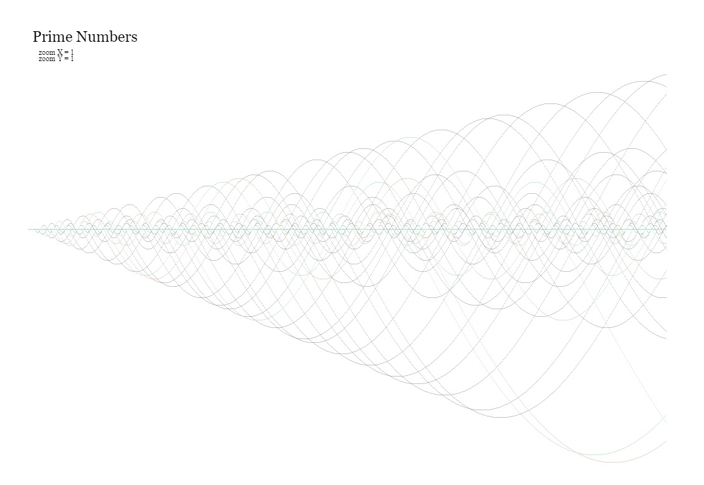

# RSA_DEBUNKED
what if,,  
the ( usual ) ASSUMPTION on which is based the famous ''security'' algorithm you rely on ..  
IS ACTUALLY FLAWED at the very root ¿?

### what's the point ?
Well,  
suppose I can predict exactly where and how any prime will show up ?  
In fact this wouldn't sound strange at all, question is ..  
why still anybody BELIEVE  that,
prime numbers, are apearing randomply sparse directly from the hand of some GOD ?  
they are just predictable as many others things, which despite having,  
a coahotic progression, that prevents them from being predictable by the usual simplistic Math reasoning ..  
( ASSUMING this , that , etc )  
they follow rules absolutely deterministic,  
and you just need to accept that reallity is just always so ..  
a cahotic progression over a fractal geometry ..  

fact is ..  
you built an imaginary world   
around a simple measuring TOOL   
( Math is just that )   
which is really great,  
as long you keep in mind it's just a TOOL ..  

problems being,  
when you start thinking, 
that Math actually rules the world ..

which is at least bizarre,  
given that almost any Geometric Shape, Math is built around ..
DOESN'T REALLY EXIST !!

there's no such things as Triangles and Circles in nature ..

( yep I did say so , prove otherwise ! )

### PRIME NUMBERS ARE PREDICTABLE ..  

how ? ..  
well ..  
this is a still secret right now, try to figure it out ..  
as soon as I can finish to write it down, will demonstrate it ..  

#### however, even more funny is that ..  
You can even get to any private key 'root numbers',  
without using prime numbers,   
AT ALL ..  

basically, once finished with this algorithm,   
you may be able to find 2 factors   
of any arbitrary digits length product,  
without factorization AT ALL.
see .. https://github.com/cloned2k16/QuantumPrimeNumbersGenerator  

#### little accessible introduction, to anybody about what RSA is all about and why it's FLAWED ..
the concept at the root of all encryption mechanism based on RSA is pretty simple..  
you find two prime numbers usually named **P** & **Q** which multiplied togheter  
gives what's called **n** aka your public key ..  
so **n** = **P** * **Q**   
eg.  **738821** = **911** * **811**  
so **738821** will be your pubblic key along, with another prime, usually very small 3 but most likely always 65537   
the exponent **e** in fact just prevents you from a side attack wich would discover the keys by just analyzing the encrypted message ..  
so your public key is the pair **(n,e)**  
from the same pair of prime numbers the   
a totient **φ(n)** is caluclater which happen to be always just **(p − 1)(q − 1)**  (737100)  
using this number and the chosen public exponent, a private exponent is calculated   
which make the private key as **(n,d)**  

so , in short all the supposed **''security''** in **RSA**   
**JUST RELY ON** .. you not being able to deduce **p** & **q**   
from their product **n**   

because they are chosen just so big ,for you NOT to be able to factorize them ..  
and, prime numbers are like voodoo ghosts that nobody can predict **LOL**  

well, (as usual) your Math gurus were wrong in their ARROGANT ASSUMPTIONS ..    

prime numbers, are just a simple cahotic progression ..   
which Math PPL don't understant, but still very easy to predict ..  
so, there's absolutely no magic in prime numbers .. 

then ,, there's at least one more, way to get to **p** & **q**  
even without considering predictability of primes numbers, at all ...  
( not to mention factorization ( which I didn't ever use in my entire life )  
.  you don't really need factorization at all, to do anything, except,
.  math masturbation with magical/divine prime numbers **LOL** )

so ..  
you better **hurry up** to find another (pseudo) ''secure'' method to protect yourself and your money ..    

RSA and entire Math base on it  will just vanish ..  
this isn't about making more feasible an hipotetic attack ..    
you may solve, by using more digits (bits) in your keys ..  

**this is about render completely useless, the entire idea of crypto security based on prime numbers modulus math..**  

please note ..  
you don't really need any special Quantum (**LOL**) computer to do it ..   
actually can even be done in pure hardware with just TTL gates ;) ( better VLSI today )

I did design something alike for other purpose decades ago  
( never made it pubblic, so don't waste time looking for )  
was meant to completely different things  
however, I'd probably be able to make a single chip which can reverse any private key in no time ..  

##### DO NOT feel safe because your crypto FAKE money use ECC (  elliptic curves ) .. they come next ..

check also .. https://github.com/cloned2k16/QuantumPrimeNumbersGenerator
